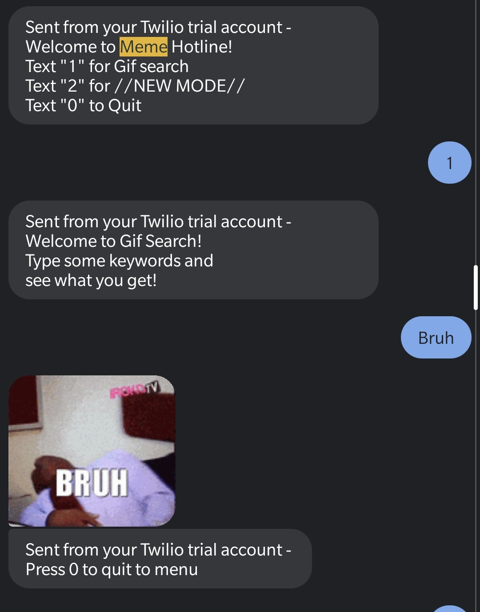
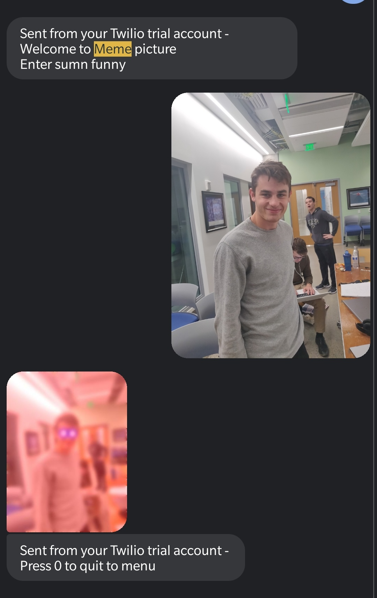

# The Meme Hotline - VandyHacks 2019 Project
By: Hamza, Ethan, Ryan  

 
This project uses the twilio api and giphy api to send texts and images to make sure you always find a meme in your most dire situation. 
 
Capability to subject text and receive giphy gif.  
 
Capability to send image and received "deep fried" version (used opencv to track eyes and add lens flares, then blurred image and made it red).  

